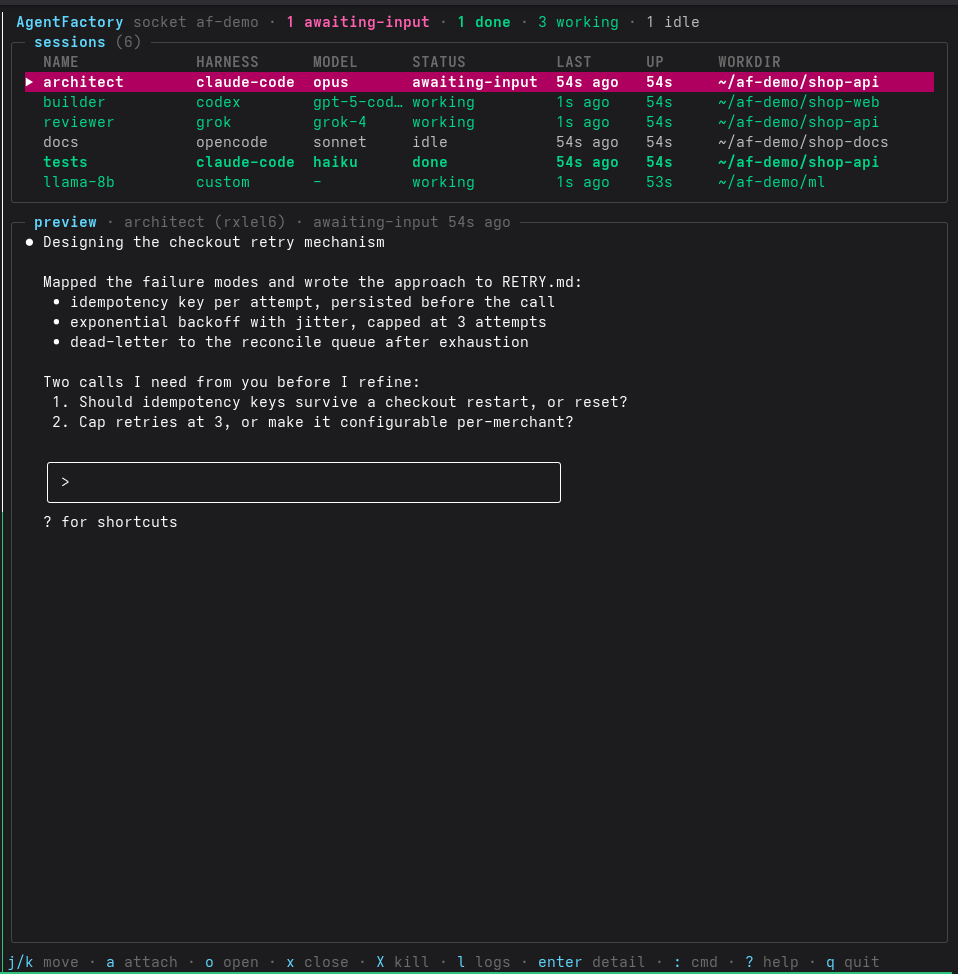

# AgentFactory

**AgentFactory is a session manager for agents — Claude Code, Codex,
Grok, OpenCode, or anything else: identity, lifecycle, live status,
agent-to-agent coordination, and one dashboard over all of them.
Daemonless, local-first, built on tmux.**

[](https://github.com/compuficial/agentfactory/actions/workflows/ci.yml)
[](https://github.com/compuficial/agentfactory/releases)
[](https://github.com/compuficial/agentfactory/stargazers)


<p align="center">
  
</p>

Running several AI agents means juggling terminal windows with no
record of what each one is, what it's doing, or whether it's been
sitting blocked on a question for the last hour. Sessions die with
their terminal, results scroll away, and agents have no way to wait on
or steer each other. `af` exists to fix exactly that:

- **One view of everything.** Every agent's status — `working`, `idle`,
  `awaiting-input`, `done`, `exited(code)` — in one list, from the CLI
  (`af status`, `--json`) or a live dashboard.
- **Define once, launch forever.** An agent definition is a name +
  harness + model + workdir. `af open planner` beats re-typing flags
  into tmux windows.
- **Know when you're needed.** A terminal bell, a notification, a
  permission dialog on screen, or an auto-wired hook flips a session to
  `awaiting-input` the moment it blocks on you — no setup; the
  dashboard makes it loud; the next output clears it automatically.
- **Perfect attach.** `af attach` execs into tmux — full fidelity,
  resize, alt-screen. Works from inside your own tmux too (detach the
  nest with `C-b C-b d`). Detach and you're back at the dashboard.
- **Script the whole fleet.** `af send` types into any session;
  `af status --json | jq ...` reads the fleet; exit codes are a
  contract.
- **Unkillable by design.** No daemon. Sessions live in tmux, state in
  SQLite; `af` reconciles the two on every invocation. Kill, upgrade,
  or rebuild `af` freely — your agents don't notice.

## Install

Requires **tmux ≥ 3.2** on `PATH`. Linux first; macOS works.

**Pre-built binaries** — grab the archive for your platform from
[Releases](https://github.com/compuficial/agentfactory/releases), then
drop `af` somewhere on `PATH`.

**From source** (Go 1.25+):

```sh
make install       # → ~/.local/bin/af, with bash completion
af doctor          # verify the environment
```

`make help` lists the rest (`build`, `test`, `fresh`, `reset`,
`uninstall`, ...). For zsh/fish completion:
`af completion zsh|fish` ([details](#shell-completion)).

## Quick start

```sh
# Any command, managed ("custom" harness)
af open --cmd 'python train.py' --name trainer

# A Claude Code agent in a specific repo
af open --harness claude-code --model opus -C ~/src/api --name planner

af status            # the fleet at a glance
af peek planner      # its current screen, rendered
af send planner "refactor the auth middleware, then run tests"
af logs planner -f   # follow its output without attaching
af attach planner    # step in (detach: C-b d)
af close planner     # graceful: quit keys → SIGTERM → SIGKILL
af kill planner      # immediate: SIGKILL the process group
```

All sessions live on a dedicated tmux socket (`tmux -L af`) with a
locked config — your personal tmux and `.tmux.conf` are never touched.

## Built-in harnesses

| Harness | Launches | Graceful close |
|---|---|---|
| `claude-code` | `claude --settings <auto-wired hooks> [--model <m>]` | `/exit` |
| `codex` | `codex [--model <m>]` | `/quit` |
| `grok` | `grok [--model <m>]` | `/exit` |
| `opencode` | `opencode [--model <m>]` | `/exit` |
| `custom` | whatever `--cmd` says | signal-only |

The `--settings` flag loads the generated hooks file that reports
`awaiting-input` — see [docs/detection.md](docs/detection.md).

`af` never talks to models — harnesses do. `--model` is passed through
untouched. A harness is pure data (a command template, env, quit keys,
detect patterns, files), so adding or overriding one is a
[config entry](#configuration), not a code change.

## Definitions: define once, launch forever

```sh
af define planner  --harness claude-code --model opus   -C ~/src/api
af define reviewer --harness claude-code --model sonnet -C ~/src/api --open
af open planner reviewer     # open several at once
af defs                      # list definitions
af rm-def reviewer           # delete one (running sessions unaffected)
```

`--open` defines and launches in one step.

## A multi-agent workflow

Three agents, three vendors, one repo — architect, builder, critic:

```sh
af define architect --harness claude-code --model opus   -C ~/src/shop
af define builder   --harness opencode    --model sonnet -C ~/src/shop
af define critic    --harness grok        --model grok-4 -C ~/src/shop

af open architect builder critic
af dashboard
```

Kick off the pipeline without attaching to anything:

```sh
af send architect "design a checkout retry mechanism; write it to RETRY.md"
af send builder   "implement RETRY.md; run the tests until green"
af send critic    "review the implementation against RETRY.md; list gaps"
```

Watch all three from the dashboard: `working` while they work, a loud
`awaiting-input` when one blocks on you, `a` to attach and unblock,
detach drops you back. Or script the loop from outside:

```sh
# who is blocked on a human?
af status --json | jq -r '.[] | select(.status=="awaiting-input") | .name'

# block until the critic stops working, then collect the review
af wait critic
af logs critic -n 100
```

Because sessions live in tmux, the whole crew survives `af` upgrades,
terminal crashes, and SSH disconnects.

## Agent-to-agent coordination

Agents can manage each other: every session has the full `af` CLI and
its own `AF_SESSION_ID`, so a coordinator agent spawns workers, waits on
them, and reads their results — no daemon, no message bus.

```sh
af open reviewer
af send reviewer "review the auth module. run: af signal \$AF_SESSION_ID done  when finished"
af wait reviewer --for done      # blocks until the reviewer reports done
af peek reviewer                 # read the result
```

`af wait` polls one reconciliation pass per tick (default `--interval
1s`) until the session reaches a `--for` status (default
`idle,awaiting-input,done` — "the agent stopped working"). Exit codes:
`0` target reached · `1` the session ended in a terminal status outside
`--for` · `5` `--timeout` elapsed. `af wait critic --for exited` waits
for termination; `--json` prints the final session object.

`af signal <session> done` is the flip side: an agent (or a hook)
reports its task complete. `done` shows green in the dashboard and
sticks until the session's next real output — exactly like
`awaiting-input`, which any agent or hook sets with
`af signal <session> awaiting-input`.

## MCP server

MCP-native harnesses (Claude Code, Codex, ...) can drive `af` through
typed tools instead of shelling out:

```sh
claude mcp add af -- af mcp      # register for Claude Code
```

`af mcp` serves MCP on stdio — spawned per client, dies with it, so the
daemonless story holds. It exposes `af_status`, `af_open`, `af_send`,
`af_peek`, `af_logs`, `af_wait`, `af_signal`, `af_close`, and `af_defs`.
Destructive management (`kill`, `rm`, `prune`, `define`) stays
human-only. An agent signals itself done with `af_signal(state:
"done")` — the session defaults to its own `AF_SESSION_ID`.

## The dashboard

`af dashboard` — dense, fast, keyboard-first.

| Key | Action |
|---|---|
| `j`/`k`, arrows | move selection (preview follows) |
| `a` | attach; detach (`C-b d`) returns to the dashboard |
| `Enter` | detail view — metadata, env (secrets masked), recent log; scrollable |
| `l` | logs view (`f` toggles follow) |
| `o` | open a session from a definition |
| `x` / `X` | close / kill, with y/n confirm |
| `:` | command bar — any `af` command, run in-process |
| `?` | help · `q` quit (sessions keep running) |

The preview pane mirrors the selected session's live screen at the
preview's own geometry. It's read-only — type via attach or `af send`.

## Service sessions

Infrastructure (a local inference server, a build watcher) uses the
same machinery; `--service` just means `close` skips quit-keys and goes
straight to SIGTERM:

```sh
af define llama-8b --cmd "llama-server -m ~/models/llama3-8b.gguf --port 8080" --service
af open llama-8b
af open local-agent    # a definition whose env points its harness at :8080
```

## Scripting

`--json` on every read command; stable exit codes on all of them:
`0` success · `1` runtime error · `2` usage error · `3` not found ·
`4` environment problem · `5` wait timeout. Sessions are addressed by
ID or name.

```sh
af status --json         # array of session objects
af defs --json           # definitions
af peek critic --json    # {"screen": "..."}
af doctor --json         # environment checks
```

Cleanup is scriptable too: `af close --all`, `af kill --all`,
`af rm <session>` (drop one finished session + its log), `af prune`
(drop all exited/failed history).

## Status model

| Status | Meaning |
|---|---|
| `starting` | created; no output observed yet |
| `working` | output within the last `idle_threshold` (default 5s) |
| `idle` | alive, quiet |
| `awaiting-input` | blocked on you — hook-signaled, terminal-declared (bell/notification/prompt mark), or screen-detected |
| `done` | agent reported its task complete (`af signal <id> done`) |
| `exited` | ended; exit code recorded (`-1` = killed by signal) |
| `failed` | tmux session disappeared without a recorded exit |

`awaiting-input` and `done` stick until the session's next real output
clears them (terminal-signal state also clears on a command-start mark;
screen-detected state clears as soon as the screen stops matching).

Blocked-detection is automatic and layered: auto-wired harness hooks
(`claude-code` out of the box), terminal signals (bell, notifications,
prompt marks), and universal screen patterns — with explicit
`af signal` always outranking them all. Details and per-harness wiring:
[docs/detection.md](docs/detection.md).

Liveness and exit codes come from tmux itself; activity from log
growth (every session's output streams to
`<data_dir>/logs/<id>.log`) — with animation frames filtered out, so a
spinner doesn't read as work. Details:
[docs/architecture.md](docs/architecture.md).

## Configuration

Optional YAML at `~/.config/agentfactory/config.yaml`; every key has a
default. Precedence: **flags > `AF_*` env > file > defaults**
(global flags `--socket`, `--data-dir`; env `AF_SOCKET`, `AF_DATA_DIR`,
`AF_IDLE_THRESHOLD`, `AF_CLOSE_TIMEOUT`, `AF_SEND_DELAY`, `AF_DETECT`,
`AF_SIGNALS`).

```yaml
socket: af                                  # tmux -L <socket>
data_dir: ~/.local/share/agentfactory       # db + logs
idle_threshold: 5s                          # working→idle cutoff
close_timeout: 10s                          # SIGTERM→SIGKILL escalation
send_delay: 50ms                            # gap between text and Enter in af send
detect: true                                # screen-pattern status detection
signals:                                    # terminal-signal detection (bell, OSC 9/777, OSC 133)
  enabled: true
  # notify_awaiting: ["(?i)permission"]     # optional: narrow which notifications count
tui:
  tick: 1s                                  # dashboard refresh

# Add harnesses, or override a built-in (same name wins):
harnesses:
  aider:
    command: "aider{{if .Model}} --model {{.Model}}{{end}}"  # Go text/template
    env: {}
    quit_keys: ["/exit"]                    # empty = signal-only close
    detect:                                 # optional screen patterns (regex)
      awaiting_input: ["\\? for shortcuts"] # quiet screen matching => awaiting-input
      working: ["esc to interrupt"]         # ...unless one of these also matches
```

Rendered commands run via `sh -c`, so templates may contain pipes and
quoting regardless of your login shell.

## Shell completion

`make install` installs bash completion (picked up automatically if
the `bash-completion` package is present). Completion is dynamic:
session arguments complete with live names and IDs, `af open` completes
definitions, `--harness` completes known harnesses.

```sh
af completion zsh  > "${fpath[1]}/_af"                    # zsh
af completion fish > ~/.config/fish/completions/af.fish   # fish
```

## Notes

- `af` manages only sessions it started; pre-existing tmux sessions and
  stray processes are invisible to it.
- Switching between different `af` builds sharing one data dir? Run
  `make fresh` after switching — a clean slate beats two builds
  fighting over one database.
- Every session gets `AF_SESSION_ID` and `AF_SESSION_NAME` in its
  environment.

## Development

```sh
go test ./... -race      # integration tests use a throwaway tmux socket
make cover               # coverage summary
make fuzz                # byte-parser fuzzers (~20s)
make help
```

Suite design: [docs/testing.md](docs/testing.md).

See [CONTRIBUTING.md](CONTRIBUTING.md) for guidelines and
[docs/architecture.md](docs/architecture.md) for the design.
Coding agents: read [AGENTS.md](AGENTS.md).

## License

[AGPL-3.0](LICENSE)
